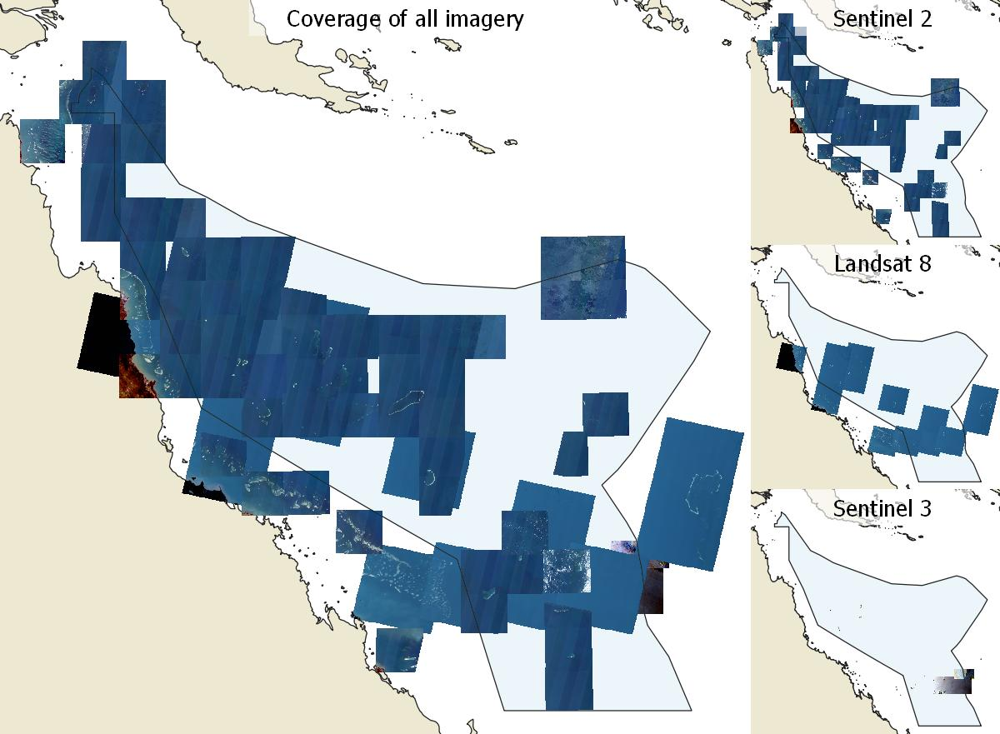

# Coral Sea Features Satellite imagery (Sentinel 2 and Landsat 8) 2015 – 2021 (AIMS)

Eric Lawrey – 4 September 2022

Australian Institute of Marine Science

## What is this dataset

This repository contains all the scripts used to create the imagery used in the 
development of the Coral Sea Features dataset. This dataset contains cloud free 
satellite image composites of the Coral Sea. The purpose of the Coral Sea imagery 
was to map the boundary reef features.



The satellite imagery was processed in the original scenes of the satellites being processed.
For Sentinel 2 this corresponds to 100 x 100 km scenes. For Landsat 8 this corresponds to 
larger scenes.

The image composites were processed into a number of different styles that each
focus on a different task:
- `DeepFalse` - False colour for best for viewing deep reef features (B2, B3, B4)
- `Shallow` - False colour showing shallow (< 3 m) and dry areas (B5, B8, B11).
- `TrueColour` - True colour imagery (B3, B4, B5)
- `Depth5m` - Reef top features down to 5 m depth. No tidal compensation.
- `Depth10m` - Reef top features down to 10 m depth. No tidal compensation.

## Sentinel 2 image processing

The satellite image composites were created using the following processing:
1. The Sentinel 2 tiles to be processed were selected using the 
[map of Sentinel 2 tiles](https://maps.eatlas.org.au/index.html?intro=false&z=7&ll=146.90137,-19.07287&l0=ea_ref%3AWorld_ESA_Sentinel-2-tiling-grid_Poly,google_SATELLITE)
to find the IDs of the locations of interest.
2. The `src\01-gee\sentinel2\01-select-sentinel2-images.js` tool in Google Earth Engine was used
to select the best images (lowest cloud, low sunglint, clear water) from those available. Typically
a low cloud cover filter used (typically starting with 1%) to eliminate unsuitable images. This
threshold was increased if not enough good images could be found.
3. These images were partitioned into two collections: the clearest of the images and the rest of the images.
These were recorded in `src\01-gee\sentinel2\03-create-composite-X.js`, where X corresponds to
the region. In this dataset the tiles were split into regions:
 - `Coral-Sea` - Images of Coral Sea reefs
 - `Coral-Sea-water` - Open water images of the Coral Sea. Used to verify that there are no new
 coral platforms.
 - `Global` - Selected reefal areas around the world to verify the robustness of the
 imaging techinques.
4. These two collections were then converted into two satellite composite images. 
5. Each image was preprocessed, prior to being combined into a composite by:
    1. Removing surface reflectance on the water based on estimates of the reflection using infrared bands.
    2. Clouds masking was applied to cut out the clouds and their shadows.
6. A composite was then created using the available images in each collection. The composite was
created using a median of the images in the collection (i.e. at each location the matching pixel of each
of the images in the collection was located and the final composite value was the median of those pixels).
7. A composite of the images with and without cloud masking was created and layered together. This 
was to solve the problem that some coral cays were misinterpretted as clouds and thus would result in
holes in the composite image. These holes are plugged with an underlying image composite created from
the same set of images, just with no cloud masking applied. Since the composite image were created using
a median reducer, as long as the cays are covered in clouds less than 50% of the time then the resulting
image would be cloud free. This works because the image collections were chosen to have very low cloud cover
and coral cays are bright areas that are much less sensitive to brightness adjustments from the fringes of 
clouds.
8. The brightness of the image was normalised to ensure that the deep water areas of the image were
consistent from one scene to the next. This was done by creating a mask of 'deep water' areas in the image.
The difference between the average brightness of these masked areas and a reference image was calculated. 
This adjustment was then applied to the whole image. This brightness adjustment helps ensure consistent
brighness across all scenes and that when subsequent contrast enhancement is applied to the images then 
no areas of the image become overly dark. Without this adjustment it was found that certain regions
would consistently produce slightly darker imagery. This can be seen in the [original draft version of this dataset](https://eatlas.org.au/data/uuid/2932dc63-9c9b-465f-80bf-09073aacaf1c) where this adjustment was not made.
9. Multiple image styles were then created from the composite image (DeepFalse, TrueColour, Shallow)
based on selecting different bands to highlight various aspects of the imagery. In this process 
contrast enhancement was applied.

More details about the processing can be found in the extensive comments in the `01-gee/sentinel2/s2Utils.js`
script library.

In addition to the imagery, depth contours (5 m and 10 m) were estimated using Satellite Derived Bathymetry. 
The intention of these contours was for the 5 m contour was to develop a more quantitative measure of the
reef top. The GBR features dataset has a matching 'Dry Reefs' dataset that has no documented definition.
Matching these features to bathymetry indicates that they correspond to approximately the 5 m depth
contour and thus don't represent areas that dry out. We therefore use an estimate of the 5 m contour
as a replacement for the 'Dry Reefs' in the Coral Sea. A 10 m contour was also developed to provide
an addtional represention of the 3D structure of the reef.

There was no high resolution bathymetry available for any of the Coral Sea reefs and so the satellite
derived bathymetry was estimated using depth measurements available in other regions. The algorithm
developed used standard green / blue band ratio, which is moderately accurate from 4 - 12 m, however
it is influenced by water colour (no too much of a problem in the Coral Sea due to the clear water), 
and substrate brightness, neither of these factors were fully compensated for in the algorthm.

As such the depth contours should not be considered as high accuracy and may contain depth errors 
up to 5 m.

They parameters needed to calibrate the band ratio depth estimate were based the limited number depth measurements 
in marine charts in Shark Bay in WA for depths between 0 - 15 m. This area was chosen due to its clear
water, gentle slopes (minimising any positional errors), and the extensive seagrass meadows that allowed us
to establish the affect of dark substrates on the depth estimates. The method used is only moderately accurate 
from 4 - 12 m of depth. The algorithm performs better than simply performing the ln(B3), but is still suseptible to 
very dark substrates, such as the thick seagrass meadows seen in Shark bay in WA, particularly in shallow areas. 
These can introduce errors of up to 5 m in depth, as compared with an error of about 8 m by just using the 
B3 channel. This algorithm was found to be less effective at shallow depths (0 - 5 m) and depths greater than 13 m 
and so contours at 5 and 10 m were extracted. 

These bathymetry polygons are raw and do contain false detections due to anomalies in the images such as clouds. 
They are merged together 

## Landsat 8 image processing

A simpler workflow was established for processing Landsat8 imagery. Less research was applied to
optimising the Landsat 8 imagery as its primary purpose was to act as backup imagery for when there
was no good Sentinel 2 images and to provide an independent set of imagery for checking the 
reef boundary mapping.

The satellite image composites were created using the following processing:
1. The `src\01-gee\landsat8\01-select-and-view-landsat8-images-app.js` tool in Google Earth Engine was used
   to select the best images (lowest cloud, low sunglint, clear water) from those available. Typically,
   a low cloud cover filter used (typically starting with 5%) to eliminate unsuitable images. This
   threshold was increased if not enough good images could be found.
2. The image IDs from the selected images were recorded in `src\01-gee\landsat8\02-create-landsat8-composite-Coral-Sea.js`.
3. Before creating a composite, each image was preprocessed, prior to being combined into a composite by:
    1. Removing surface reflectance on the water based on estimates of the reflection using the shortwave infrared band (B6).
    2. Clouds masking was applied to cut out the clouds and their shadows.
4. A composite was then created using the available images in each collection. The composite was
   created using a median of the images in the collection (i.e. at each location the matching pixel of each
   of the images in the collection was located and the final composite value was the median of those pixels).

More details about the processing can be found in comments in the `01-gee/landsat8/l8Utils.js` script library.

## This repository contains: 
1. Google Earth Engine javascript code that generates the satellite image composites and depth contours
and exports them to Google Drive. 
2. Local Python scripts for subsequent optimisation of the image file format,
generation of GDAL virtual layers and merging of the depth contours. 

This repository does not contain the image data itself. The image data files were too large to include
in the repository however they are available for [downloading and browsing](https://nextcloud.eatlas.org.au/apps/sharealias/a/cs-aims-coral-sea-features-img)
To reconstruct this dataset and scripts as was originally prepared these files should be placed in the `big-files` directory.


## Regional coverage of images
This dataset contains imagery for three regions:
- `Coral Sea`: Used for mapping the reefs for the [Coral Sea mapping project](https://eatlas.org.au/projects-other/coral-sea-reef-mapping)
- `Coral Sea Open Water`: This is satellite imagery of open water in the Coral Sea. This 
imagery was produced to check for any as yet unknown coral reefs in the Coral Sea. This
imagery will be of little interest otherwise, and so was separated out to shrink the
size of the more useful `Coral Sea` imagery. This imagery was only processed using the `DeepFalse`
to save on space.

## Dataset metadata and lineage
More information about this dataset can be found on the 
[Dataset metadata page](https://eatlas.org.au/data/uuid/df5a5b47-ad4c-431e-be49-af52f64aafce).

This dataset is an update and improvement to the 
[Coral Sea Sentinel 2 Marine Satellite Composite Draft Imagery version 0 (AIMS)](https://eatlas.org.au/data/uuid/2932dc63-9c9b-465f-80bf-09073aacaf1c)
dataset.

## Folders
`big-files`: This contains all large files in this dataset including all the final satellite
imagery and GIS file to make preview maps. These files are not stored in the repository
as GitHub and particularly Google Earth Engine impose limitations on repository storage.
These files are available for [download and browsing](https://nextcloud.eatlas.org.au/apps/sharealias/a/cs-aims-coral-sea-features-img).

`media`: This contains preview images. These images are kept small to allow this repository
to be uploaded to Google Earth Engine, which only supports small files.

`src\01-gee`: This corresponds to the Google Earth Engine scripts used for the production
of this imagery in this dataset.

`src\01-gee\landsat8`: This corresponds to Google Earth Engine scripts for processing Landsat 8 imagery.
This includes an app for choosing images to create a final composite image and a script
for recording the actual images processed to make the images in this dataset.

`src\01-gee\landsat8`: This corresponds to the Google Earth Engine scripts for processing the
Sentinel 2 images. These were the primary image sources used in mapping the reef boundaries
of the Coral Sea.

`src\02-local`: This contains the Python\GDAL script that is run on your local machine to
post process the imagery downloaded from GEE into the `unprocessed-data` folder. This script
optimises the internals of the GeoTiff images (adding internal tiling and overviews) and
creates GDAL virtual rasters to make the images easier to manipulate in QGIS.

`unprocessed-data`: Images generated by GEE should be exported to Google Drive then downloaded
into this folder. The `src\02-local\convert.py` script will then process them into the `big-files\data`
folder. Once the image has been processed they can be deleted from this directory.

## Reproducing this dataset

This repository is intended to allow others to reproduce and extend this
dataset. 

## Setup and installation
This dataset is created using the Google Earth Engine followed by some
file format adjustments using a Python scripts to process the imagery using
GDAL tools. For the depth contours the Python script uses OGR2OGR to 
merge all the polygons from each image tile into single shapefiles for
each region (Coral Sea, Global)

To reproduce this dataset from scratch you will need:
 - [Google Earth Engine account](https://earthengine.google.com/)
 - Python and GDAL installed. On Windows [OSGeo4W](https://www.osgeo.org/projects/osgeo4w/) 
 can be used to install both QGIS and GDAL. If you have troubles with OSGeo4W you can install
 GDAL via Anaconda)
 - Git - For copying code from GitHub into Google Earth Engine
 - Google Drive with >30 GB of space for exporting the imagery from Google Earth Engine.

On Windows this can be done using OSGeo4W or Anaconda.
 
### OSGeo4W
I have used OSGeo4W for many years to install both QGIS and GDAL.
1. Download and install OSGeo4W making sure GDAL gets installed (https://www.osgeo.org/projects/osgeo4w/)
2. Start the OSGeo4W cmd window. The default path for this is C:\OSGeo4W64\OSGeo4W.bat
3. Test that GDAL installed OK by running: `gdalinfo --version`
   You should get something like: GDAL 3.4.1, released 2021/12/27
4. `cd <directory to this script (convert.py)>`
5. `python convert.py`

If you have trouble with GDAL from OSGeo4W (which sometime happens) you can install GDAL
via Anaconda.

### Anaconda - GDAL only
1. Download and install Anaconda from (https://www.anaconda.com/products/individual). 
2. Start the Anaconda Navigator / CMD.exe 
3. Run `conda install -c conda-forge gdal`
4. Test that GDAL installed OK by running: `gdalinfo --version`
   You should get something like: GDAL 3.0.2, released 2019/10/28
5. `cd <directory to this script (convert.py)>`
6. `python convert.py`
 

### Google Earth Engine Setup

The most reliable way of getting the code into Google Earth is using Git to pull the 
code from GitHub then push it into Google Earth Engine. This is described in detail 
below. You can however also simply manually copy the files from `src\01-gee` into
a session on Google Earth Engine to run them.

Once you have a copy of the code in Google Earth Engine you need to adjust the 
path to the `s2Utils.js` and `l8utils.js` in each of the scripts to match
your username and repository name. Each of the main processing scripts
uses an associated library file, one for Sentinel 2 processing and one for Landsat8
processing. This library is imported as the first line in each of the scripts.
Unfortunately Google Earth Engine does not support relative paths for these
imports and so they are absolute paths. As a result when you copy the code
into your repository these paths will not work.

In the sentinel 2 scripts this line will look something like:
```
var s2Utils = require('users/ericlawrey/CS_AIMS_Coral-Sea-Features_Img:src/01-gee/sentinel2/s2Utils.js');
```
If your Google Earth Engine username is `janesmith` and the repository that you copied
the code into is called `Coral-sea-imagery` then the above code should be changed to:
```
var s2Utils = require('users/janesmith/Coral-sea-imagery:src/01-gee/sentinel2/s2Utils.js');
```


### Clone this repository into Google Earth Engine
If you want to entended the code in this repository it is probably better to
clone the entire repository into GEE. To do this:

1. Create an empty repository in GEE using `Scripts\NEW\Repository`. Name the 
repository `CS_AIMS_Coral-Sea-Features_Img`. Technically the names don't need
to match but it could get confusing if the names don't match.

2. On you local machine clone the repository from GitHub. 
```
git clone https://github.com/eatlas/CS_AIMS_Coral-Sea-Features_Img.git
```

3. Change into the newly downloaded empty repository, cloned from GEE. 
```
cd CS_AIMS_Coral-Sea-Features_Img
```

4. Switch the push origin to the GEE repository. Find the path to your empty
GEE repository by hovering over the new repository and select the `Configure` 
button (it looks like a small cog). 
This will show the command to clone the new repository to your local machine. For
```
git clone https://earthengine.googlesource.com/users/<username>/CS_AIMS_Coral-Sea-Features_Img
```
We are interested in the path to the repository. Add this as the push
origin. 
```
git remote set-url origin https://earthengine.googlesource.com/users/<username>/CS_AIMS_Coral-Sea-Features_Img
```
5. Push the repository up to GEE.
```
git push 
```
6. Refresh the repositories in GEE. There is a refresh button next to the `NEW` button.
You can now make changes on your local machine and push them up to GEE. If you make changes
on GEE you will need to perform a `git pull`. 

### Pushing code back to GitHub from local
If you have write access you can push code back to GitHub instead of GEE using:
```
git push https://github.com/eatlas/CS_AIMS_Coral-Sea-Features_Img.git
```

### Pull from Google Earth Engine to local
If you have made code changes in Google Earth Engine and would like to bring them back into
your local copy, so you can push back into GitHub then use:
```
git pull
```
This is assuming that you set the Google Earth Engine as the origin for the repository.
(See step 4 in Clone this repository into Google Earth Engine)

## Running the code

Each of the Google Earth Engine scripts are ordered based on how they were used in the 
creation of the dataset.

`01-gee/sentinel2/01-select-sentinel2-images.js` was used to select individual images to 
include in our image composites. It allows you to step through all the available images
with some prefiltering based on cloud cover. When a good image was found its IDs was
noted down and recorded in `03-create-composite-Coral-Sea.js`, `03-create-composite-Coral-Sea-water.js`
or `03-create-composite-Global.js` depending on the region being developed.

`02-view-selected-sentinel2-images.js` is a utility script used for reviewing images
based on their IDs. Sometimes after collecting a bunch of images I might wish to review 
them again. Pasting the image IDs into this script allowed stepping through just those
images.

`03-create-composite-Coral-Sea.js`, `03-create-composite-Coral-Sea-water.js`
and `03-create-composite-Global.js` are the scripts that generate the images and depth
GeoJson files. These scripts can be modified to view just a single scene interactively
or used to trigger all the Google Earth Engine tasks to render and export the full resolution
images. They are the record of the images that were used to create the composite images
in this dataset. These scripts can generate hundreds of export tasks in
Google Earth Engine which is very slow to trigger manually. This can be spead up using
the Javascript hack outlined below.


## Exporting many images from Google Earth Engine
The `03-create-composite-X.js` scripts generate many run tasks to perform the export of each
image. Manually clicking the `Run` button can be quite tedious. Ideally the code could have been
rewritten into Python to automate this process. (Maybe next time). 

You can automate the clicking of the `Run` button with Javascript pasted
into the Webbrowser console, noting that this automated attempts to open all the
export task dialogs at once and so might crash your browser. If this happens try processing
in smaller batches.
https://gis.stackexchange.com/questions/290771/batch-task-execution-in-google-earth-engine

1. Run the `03-create-composite-X.js` script and wait for all the tasks to be generated, waiting
for your input to trigger them.
2. Open your browser Web Developer Tools (usually Ctrl+Shift+I) and go to the Console. Paste the 
following Javascript. This setups the functions for triggering run and confirm buttons in the 
browser.

``` Javascript
/**
 * Copyright (c) 2017 Dongdong Kong. All rights reserved.
 * This work is licensed under the terms of the MIT license.  
 * For a copy, see <https://opensource.org/licenses/MIT>.
 *
 * Batch execute GEE Export task
 *
 * First of all, You need to generate export tasks. And run button was shown.
 *   
 * Then press F12 get into console, then paste those scripts in it, and press 
 * enter. All the task will be start automatically. 
 * (Firefox and Chrome are supported. Other Browsers I didn't test.)
 * 
 * @Author: 
 *  Dongdong Kong, 28 Aug' 2017, Sun Yat-sen University
 *  yzq.yang, 17 Sep' 2021
 */
function runTaskList(){
    // var tasklist = document.getElementsByClassName('task local type-EXPORT_IMAGE awaiting-user-config');
    // for (var i = 0; i < tasklist.length; i++)
    //         tasklist[i].getElementsByClassName('run-button')[0].click();
    $$('.run-button' ,$$('ee-task-pane')[0].shadowRoot).forEach(function(e) {
         e.click();
    })
}

function confirmAll() {
    // var ok = document.getElementsByClassName('goog-buttonset-default goog-buttonset-action');
    // for (var i = 0; i < ok.length; i++)
    //     ok[i].click();
    $$('ee-table-config-dialog, ee-image-config-dialog').forEach(function(e) {
         var eeDialog = $$('ee-dialog', e.shadowRoot)[0]
         var paperDialog = $$('paper-dialog', eeDialog.shadowRoot)[0]
         $$('.ok-button', paperDialog)[0].click()
    })
}
```
Paste the above functions, then paste runTaskList(), then paste confirmAll().
Run this line then wait until all tasks popups have been created. This might take a few minutes
as there maybe potentially hundreds of dialogue being rendered. If this process crashes your
browser then you will need to reduce the number of exports being performed in one batch. See
the section below.
``` Javascript
runTaskList();
```

Once all the dialogue boxes have appeared then run this command to confirm all of them.
``` Javascript
confirmAll();
```

## Limiting the number of exported images - I only have limited Google Drive space
To make this process more managable you can adjust the code to export one colourGrade at a time. i.e. change
```
var REF1_OPTIONS = {
  colourGrades: ['DeepFalse','TrueColour','Shallow','Depth5m', 'Depth10m'],
  exportScale: [10, 10, 10, 10, 10],
```
to
```
var REF1_OPTIONS = {
  colourGrades: ['DeepFalse'],
  exportScale: [10],
```
Then perform the exports in batches, switching the colourGrade in each batch.


## Common Issues with using the code

### Error in Google Earth Engine: Cannot find required repo: users/ericlawrey/CS_AIMS_Sentinel2-marine_V0:utils
If you make a copy of the code in your own repository then you need to update the path to the `s2Utils` script 
to point at your local copy. The `users/ericlawrey/CS_AIMS_Coral-Sea-Features_Img:01-gee/sentinal2/s2Utils` is not public, 
thus can't be referenced from a copy. To fix this update the username and repository name to match your copy. I haven't 
made it public on GEE because it might get out of sync with the Git version. 

### Does the `users/ericlawrey/World_ESA_Sentinel-2-tiling-grid` path need updating
This dataset is made public on the Google Earth Engine to allow it to be easily reused in the code and so its path does 
not need updating. You can find details of this dataset [here](https://code.earthengine.google.com/?asset=users/ericlawrey/World_ESA_Sentinel-2-tiling-grid)


## Videos
The following are some videos that were developed during the project to document some of the processes.

[Selecting the best Coral Sea Sentinel 2 imagery (Coral Sea Mapping project)](https://www.youtube.com/watch?v=EqmLZmxZcQc) 
This video is from the [original draft version of this dataset](https://eatlas.org.au/data/uuid/2932dc63-9c9b-465f-80bf-09073aacaf1c). 
This is a team training video on how to select images for creating composite images. Most of this video is still relevant 
in that the process used for classifying and choosing images to include in the final composites is the same as described in this video. The main changes are:
- It is now recommended to use `git clone` and `git push` to get the source code into GEE, as described above, instead manually copying each file.
- The image selection script no longer generates lots of image colour grading styles to speed it up.
- The Sentinel 2 utility library is now called `s2Utils` instead of `utils` to accomodate the Landsat utils library.
- The dataset name was renamed from `CS_AIMS_Sentinel2-marine_V1` to `CS_AIMS_Coral-Sea-Features_Img` to indicate that this dataset 
contains the imagery used in the creation of the `Coral-Sea-Features` dataset.


